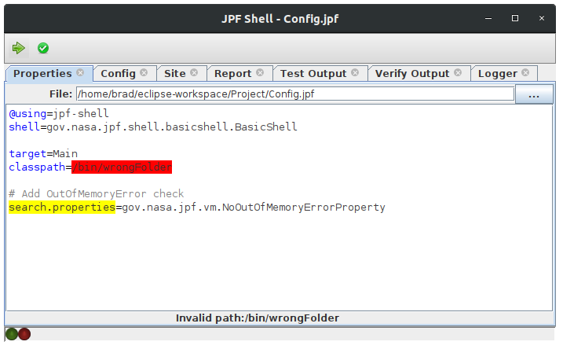

# Improving JPF-Shell

## About
JPF-Shell is a graphical interface extension for [JPF](https://github.com/javapathfinder/jpf-core). The orignal project can be found [here](https://jpf.byu.edu/hg/jpf-shell)

This fork adds syntax and error reporting for JPF configuration files in an effort to simplify the setup process and improve error reporting for common configuration errors.

<div align="center">
    
</div>

<hr/>

## Setup

### Prerequisites
* [jpf-core](https://github.com/javapathfinder/jpf-core)
* [ANT](https://ant.apache.org/)
* Eclipse

### Importing the project

1. Clone the repository using `git clone repo-name`
2. Import the project into eclipse: `File > Import > Exisiting Projects into Workspace`
3. Add jpf.jar to the build path: `Right Click Project > Build Path > Configure Build Path > Libraries > Add JARs > Select jpf.jar (Located in jpf-core/build) > Apply`
4. You should now see ANT build the project

### Configure

1. Update site.properties (typically located at ~/.jpf/site.properties) to use JPF-Shell, for example:
```
### site.properties

jpf-core = ${user.home}/Documents/school/EECS4315/jpf/jpf-core
jpf-shell = ${user.home}/Documents/school/EECS4315/project/jpf-shell

extensions = ${jpf-core},${jpf-shell}
```

### Run
JPF-Shell can now be launched on any jpf project by adding the following to the .jpf configuration:

```
@using=jpf-shell
shell=gov.nasa.jpf.shell.basicshell.BasicShell
```
And running the jpf project as normal.

Sample projects can be found in `src/examples/runnable/` for example, `Racer.jpf`
<hr/>


## Testing

Due to the interface heavy components of JPF-Shell, testing can be difficult. As a result, efforts have been made to decouple interface and functional components where possible.

Tests relating to the improvements can be found in `/src/main/jpf/shell/util/editor/UtilitiesTest.java`. These tests use JUnit 5 and can be run in eclipse by: `Right Click UtilitiesTest.java > Run As > Junit Test`
